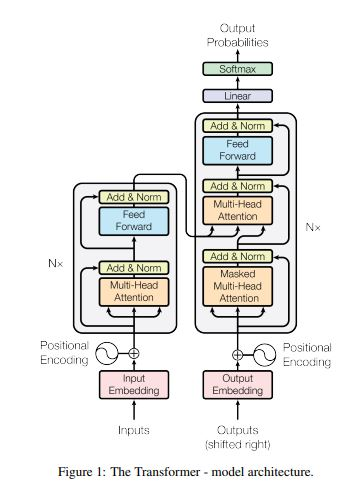

# 🚀 A Jornada do Transformer: Atenção Desvendada!

🎮 **Jogue agora no navegador:**  
👉 [https://transformer-game-app.streamlit.app](https://transformer-game-app.streamlit.app)

---

Este é um jogo interativo e educativo, criado para explorar de forma lúdica os principais conceitos do paper **"Attention Is All You Need"** (Vaswani et al., 2017), base teórica dos modelos Transformer modernos como BERT, GPT, T5 e outros.

> 🎯 Ideal para estudantes, pesquisadores e curiosos que querem aprender IA de maneira engajada e visual.

---

## 🧩 Sobre o Jogo

O jogo é dividido em **cinco fases interativas** + um **resumo final**. Cada fase aborda um aspecto fundamental do modelo Transformer, com desafios simples, simulações, gráficos e explicações técnicas.

| Fase | Tema | Interação |
|------|------|-----------|
| 1️⃣ | Arquitetura Encoder-Decoder | Montagem lógica com blocos de modelo |
| 2️⃣ | Atenção Escalonada (Q · K / √dₖ) | Simulador com sliders para vetores |
| 3️⃣ | Multi-Head Attention | Observação de diferentes padrões de atenção |
| 4️⃣ | Positional Encoding | Gráfico de senoides + compreensão da ordem |
| 5️⃣ | Resultados e Eficiência | Simulação + mini interação com ranking |
| 🏁 | Resumo Final | Revisão completa dos conceitos aprendidos |

---

## 💡 Funcionalidades

- 🤖 **LLM integrada no sidebar** – Tire dúvidas com um modelo real (Qwen2.5-7B-Instruct-Turbo, via Hugging Face Router API)
- 🐞 **Caixa de feedback** – Reporte erros conceituais que são automaticamente registrados em um repositório privado GitHub
- 📊 **Gráficos interativos e simulações** – Veja visualmente como funcionam senoides, vetores Q/K, e mais
- 🧠 **Foco pedagógico** – Cada fase inclui explicações além do artigo e reforços conceituais aplicados

---

## 🛠️ Tecnologias Utilizadas

- [Streamlit](https://streamlit.io)
- [Matplotlib](https://matplotlib.org)
- [Hugging Face Inference API](https://huggingface.co/inference-endpoints)
- [PyGithub](https://pygithub.readthedocs.io/)
- [huggingface_hub](https://huggingface.co/docs/huggingface_hub)

---

## 🧠 IA na Criação

Este projeto foi desenvolvido com a colaboração ativa de **duas das principais inteligências artificiais atuais**:

- **Gemini 2.5 (Google)** – utilizada para **sugestões conceituais, revisão pedagógica** e também para **geração de código e design de interação**.
- **ChatGPT-4o (OpenAI)** – utilizada para **estruturação de código, depuração, explicações técnicas** e melhorias de linguagem natural.

> O jogo é um exemplo de coautoria humano-IA no desenvolvimento de aplicações educacionais interativas.

---

## 📷 Capturas de Tela

| Tela Inicial | Fase 2 – Simulador de Atenção |
|--------------|-------------------------------|
|  |  |

---

## 🤝 Licença

Este projeto é open-source, licenciado sob a **MIT License**.  
Sinta-se à vontade para aprender com ele, adaptá-lo e compartilhar!

